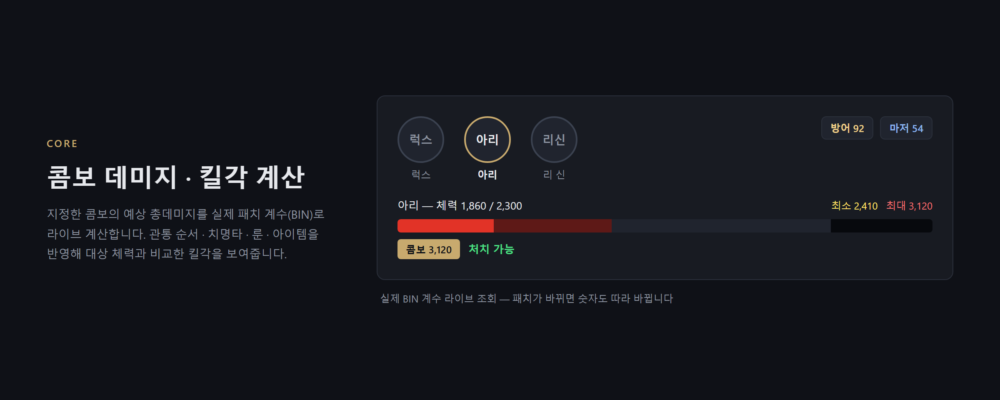
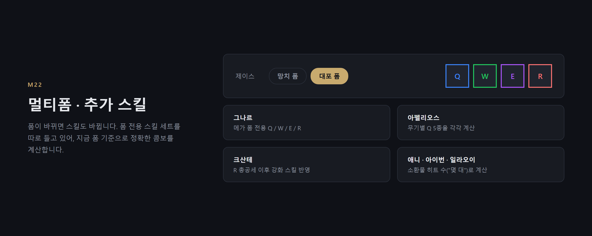
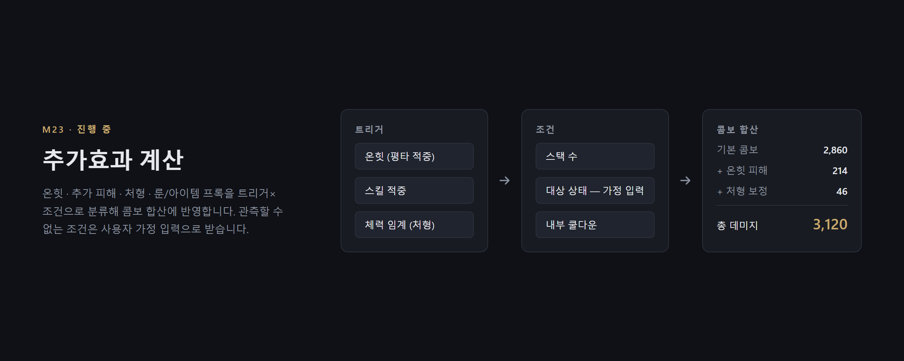
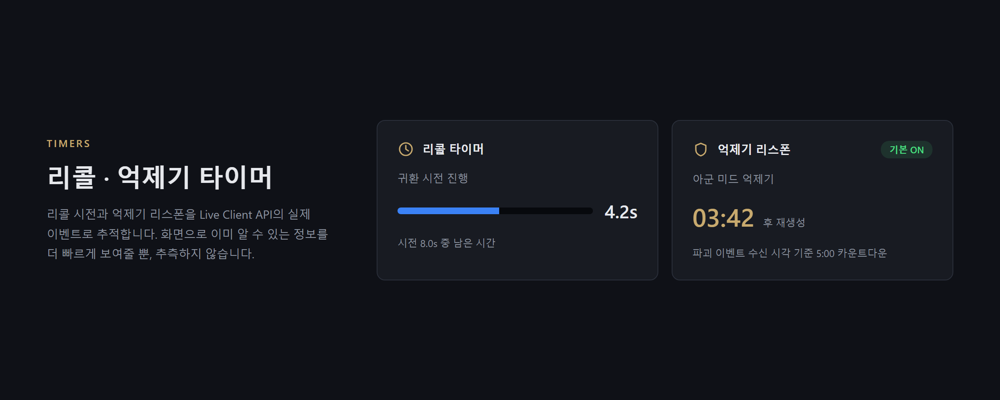
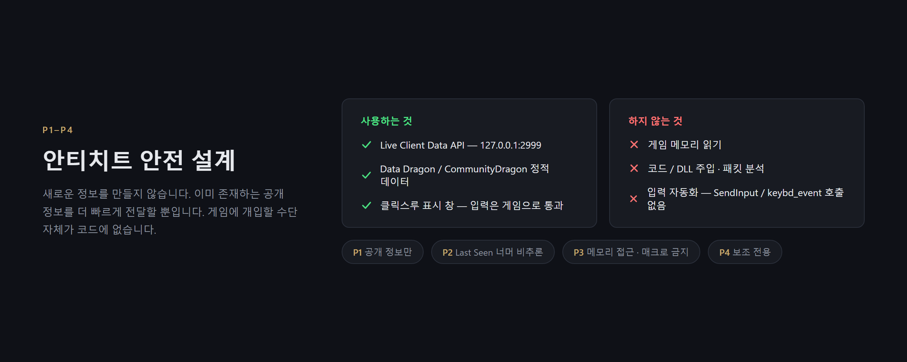
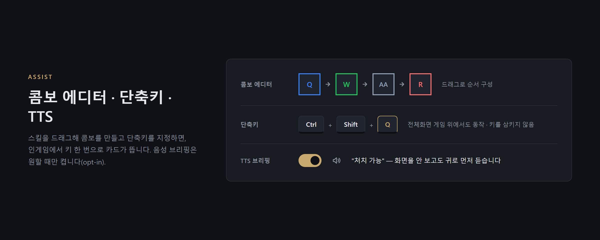

# Fova

**A lightweight League of Legends desktop companion — combo damage calculator with an in-game
overlay, plus champ-select rune & spell presets.**

가볍고 정직한 리그 오브 레전드 데스크톱 컴패니언 — 콤보 데미지 계산기 + 인게임 오버레이,
그리고 픽창 룬/스펠 프리셋.

> Status: pre-release (open beta). **The source is here** — this repository holds both the product page and the code that produces the published build.
> 배포 브랜치(`main`)만 공개합니다. 개발 기록과 작업 히스토리는 비공개로 둡니다.

---

## What it does · 무엇을 하나요

### 콤보 데미지 계산기 · Combo damage calculator



**Combo damage calculator (콤보 데미지 계산기)** — build ability combos per champion; during a
match, a click-through overlay shows the combo's expected damage against your current target,
computed from your own live stats (levels, items, runes). Damage formulas come from Riot's own
static game data, hand-verified per champion.



폼이 바뀌면 스킬 세트도 바뀝니다 — 제이스 대포/망치, 그나르 메가, 아펠리오스 무기별 Q, 크산테 R
총공세, 소환수 히트 수까지 지금 폼 기준으로 계산합니다.



온힛·처형·룬/아이템 프록 같은 추가효과는 트리거×조건으로 분류해 합산에 반영합니다(개발 중). 관측할
수 없는 조건은 추측하지 않고 사용자 가정 입력으로 받습니다.

### 픽창 보조 · Champ-select assistant

**Champ-select assistant (픽창 보조)** — save your preferred rune page and summoner spells per
champion, then re-apply them with one click (or an explicit opt-in auto-apply on lock-in) through
the League Client's own local API. Your hand-made rune pages are never touched without an
explicit confirmation.

### 편의 기능 · Quality-of-life helpers



**Quality-of-life helpers** — recall/objective timers, item completion alerts, enemy-jungler
spotted notifications, optional voice (TTS) alerts.

## Safety & fair play · 안전과 공정성



Fova is designed to be anti-cheat-safe and policy-compliant by construction:

- Reads **only public, Riot-provided data**: the local Live Client Data API
  (`https://127.0.0.1:2999`), Data Dragon, CommunityDragon static data, and the local League
  Client (LCU) API for champ-select rune/spell writes.
- **No memory reading, no injection, no input automation, no scripting, no packet manipulation.**
- The overlay is a separate click-through window that **displays information only** — it never
  acts in-game on your behalf, and it infers nothing beyond what the game client publishes
  (no fog-of-war prediction).
- **No ads in-game, ever.** In line with Riot's third-party advertising policy (effective
  2025-05-29), advertising exists only as a single static banner in the desktop app's home
  window, and the ad slot hard-disables the moment a game is detected. Fova is free for all
  players.

## Requirements · 요구 사항

- Windows 10 (2004 이상) / 11, 64비트
- .NET 8 **Desktop** Runtime (x64)
- League of Legends (KR/global clients)

## 설치하기 · Install

### 1. 받기

**[⬇ fova-0.1.0.zip 내려받기](release/fova-0.1.0.zip)**  (3.9 MB)

### 2. .NET 8 데스크톱 런타임 (한 번만)

**[⬇ .NET 8 Desktop Runtime (x64)](https://dotnet.microsoft.com/ko-kr/download/dotnet/8.0/runtime)**

> ⚠️ **"Desktop Runtime"** 이어야 합니다. 그냥 "Runtime"으로는 안 켜집니다.
> 페이지에서 **Windows → x64 → Desktop Runtime**을 고르세요. 앱이 안 켜지는 이유 대부분이 이겁니다.

### 3. 압축 풀고 실행

1. 원하는 폴더에 풉니다 (예: `C:\Fova`). 설정 파일을 옆에 만들기 때문에 폴더째로 두세요.
2. `fova.exe` 실행
3. **"이 앱이 디바이스를 변경하도록 허용하시겠어요?"** → **예**

설치 프로그램은 없습니다. 지울 때도 폴더만 삭제하면 됩니다.

### 왜 관리자 권한을 물어보나요

**단축키가 게임 안에서 작동하게 하려고**입니다. 롤 클라이언트가 관리자 권한으로 돌아가는데, 윈도우
규칙상 더 낮은 권한의 프로그램은 그 위에서 키 입력을 받을 수 없습니다. 권한을 안 올리면 단축키가
다른 창에서는 되고 **게임 안에서만** 안 먹습니다. 거절해도 앱은 켜집니다 — 인게임 단축키만 죽습니다.

---

## 쓰는 법 · Usage

게임에 들어가면 오버레이가 자동으로 켜집니다.

| 기본 단축키 | 기능 |
| --- | --- |
| `Shift + Tab` | 오버레이 켜고 끄기 |
| `Alt + 1` | 콤보 결과 오버레이 |
| `Alt + 2` | 스킬별 데미지 오버레이 |



**콤보 만들기**: 홈 창 → 콤보 설정 → 챔피언 선택 → 스킬을 순서대로 끌어다 놓기 → 단축키 지정.
**위치 보정**: 설정에서 "이동 여부"를 켜고 카드를 드래그.

### 잘 안 될 때

- **앱이 아예 안 켜져요** → .NET 8 **Desktop** Runtime을 확인하세요 (위 2단계).
- **게임 안에서만 단축키가 안 먹어요** → UAC 창에서 "예"를 누르셨는지 확인하세요.
- **숫자가 안 나와요** → 연습 모드나 실제 게임에 들어가야 인게임 API가 열립니다.
- **백신이 경고해요** → 아래 "키보드 훅" 항목을 봐주세요.

---

## 키보드 훅에 대해 · About the keyboard hook

게임 위에서 단축키를 받으려면 이 방법뿐이라 **전역 키보드 훅**을 씁니다. 백신이 민감하게 보는
API라 경고가 뜰 수 있어서, 하는 일과 안 하는 일을 적어둡니다. 코드는
[`src/Overlay.Client/Hotkeys/LowLevelHotkeyHook.cs`](src/Overlay.Client/Hotkeys/LowLevelHotkeyHook.cs)
에서 직접 확인하실 수 있습니다.

- **키를 가로채지 않습니다.** `HookCallback`의 반환 경로는 `return CallNextHookEx(...)` 하나뿐이라
  모든 입력이 그대로 게임에 전달됩니다.
- **키를 저장하거나 전송하지 않습니다.** 기억하는 건 등록된 단축키 조합과 지금 눌린
  `Ctrl`/`Alt`/`Shift`뿐입니다. 입력 기록도, 파일 저장도, 네트워크 전송도 없습니다.
- `GetAsyncKeyState` / `GetKeyboardState`를 쓰지 않고, `SendInput` / `keybd_event`도 없습니다 —
  **대신 키를 눌러줄 수단이 코드에 없습니다.**

훅을 쓰지 않는 구현(`Hotkeys/Win32HotkeyHook.cs`)도 트리에 있지만, 인게임 단축키와 클릭-투-타겟을
잃습니다.

---

## 빌드 · Building

```
dotnet build LolOverlay.sln -c Release -p:LightMode=true
pwsh packaging/build-release.ps1 -Version 1.0.0
```

`LightMode`는 **미니맵 화면 캡처 기능을 컴파일 단계에서 제외**합니다. 공개 배포본에는 화면을 읽는
코드가 들어 있지 않습니다 (Vortice/DXGI/WGC 의존성 0개).

## Contact · 문의

Open an issue on this repository.

---

## 라이선스 · License

**소스는 공개돼 있지만 오픈소스가 아닙니다.** 공개는 검증을 위한 것이지 재사용 허가가 아닙니다.

- ✅ **개인적·비상업적 사용**, 소스 열람과 **안전성 검증**, 개인 용도 수정
- ❌ 재배포·공개 게시(수정 여부 무관), 판매·상업적 이용, **동봉 데이터 추출 후 별도 사용**

전문은 [LICENSE](LICENSE)를 봐주세요. 그 범위를 넘는 이용은 문의 바랍니다.

---

<sub>Fova는 Riot Games가 승인하거나 후원한 프로그램이 아닙니다. 서드파티 도구에 대한 정책은 Riot이 언제든 변경할 수 있으며 그 부분은 저희가 통제할 수 없습니다.
League of Legends 및 관련 자산은 Riot Games, Inc.의 상표 및 저작물입니다.</sub>
